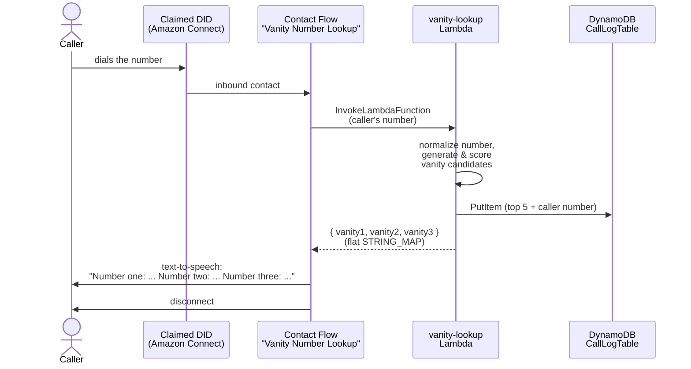
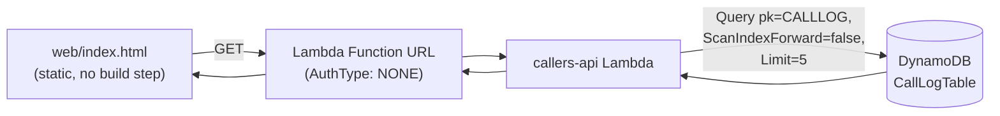
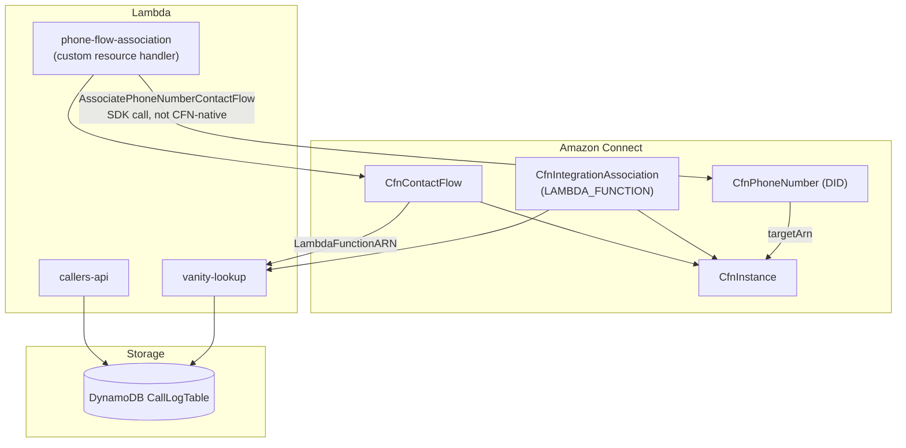

# Architecture

## Call path (the required deliverable)

## Bonus: "last 5 callers" web app

## Deployed resources (AWS CDK, TypeScript)

## Component notes

- **vanity-lookup Lambda** (`lambda/vanity-lookup/`) — pure, dependency-free algorithm in `vanity.ts`, unit tested in `vanity.test.ts` independent of AWS. `index.ts` is the thin Connect-facing adapter (parse event, call algorithm, write DynamoDB, shape the response).
- **DynamoDB CallLogTable** — one partition (`pk = "CALLLOG"`), sorted by `sk = ISO timestamp#contactId`. Serves both the write side (call logging) and the bonus read side (`Query`, no scan, no GSI) from a single table. Does not scale past a single-partition write ceiling — see [design-notes.md](design-notes.md) §4.
- **Contact flow** — authored as Connect "Flow language" JSON in `infra/lib/contact-flow-content.ts` rather than built in the visual designer, so it's versioned like the rest of the code. Invoke Lambda → success branch speaks the 3 vanity numbers via `$.External.vanity1/2/3`; error branch (any Lambda failure Connect itself catches) speaks an apology instead of failing the call.
- **phone-flow-association custom resource** — `AWS::Connect::PhoneNumber` has no CloudFormation property to bind a claimed number to a contact flow; that's only exposed via the `AssociatePhoneNumberContactFlow` API. A small Lambda behind a CDK `custom_resources.Provider` fills that gap on stack create/update. See `lambda/phone-flow-association/index.ts`.
- **callers-api Lambda + Function URL** — bonus feature, deliberately minimal (no API Gateway, no S3/CloudFront for the static page) per the "small scale" instruction in the brief.
