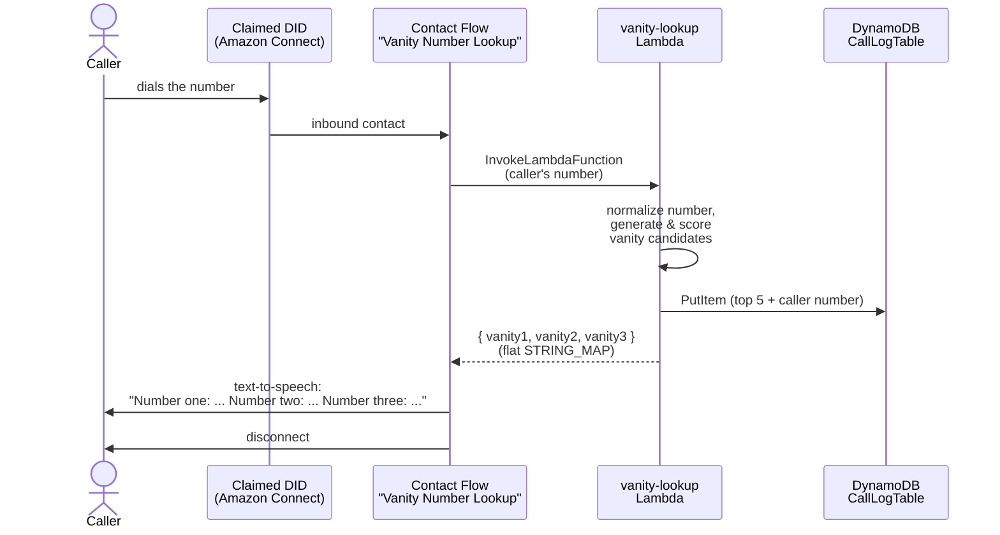
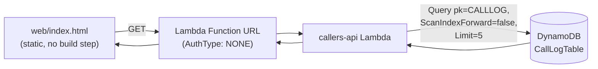
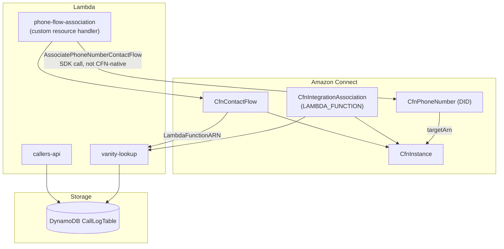

# Architecture

## How a phone call flows through the system

## Bonus: the "last 5 callers" web page

## Everything the CDK stack creates (AWS CDK, TypeScript)

## What each piece does

- **vanity-lookup Lambda** (`lambda/vanity-lookup/`) — the actual algorithm lives in `vanity.ts`, kept separate from any AWS code so it can be tested on its own (`vanity.test.ts`). `index.ts` is a small wrapper that reads the incoming call event, runs the algorithm, saves to DynamoDB, and sends back the result.
- **DynamoDB CallLogTable** — all call records sit in one partition (`pk = "CALLLOG"`), sorted by a timestamp. This keeps things simple: both saving a new call and reading "the last 5 callers" are cheap, basic queries with no extra index needed. The trade-off is that one partition can only take so many writes per second — see [design-notes.md](design-notes.md) section 4.
- **Contact flow** — written as JSON code in `infra/lib/contact-flow-content.ts` instead of built by hand in Amazon Connect's drag-and-drop editor, so it's tracked in version control like everything else. It calls the Lambda, and on success reads back the 3 vanity numbers it returned; if the Lambda call fails for any reason, it plays an apology message instead of just failing silently.
- **phone-flow-association (custom resource)** — CloudFormation has no built-in way to connect a claimed phone number to a call flow; that connection can only be made through a separate API call. This is a small Lambda that CloudFormation runs automatically to make that one API call. See `lambda/phone-flow-association/index.ts`.
- **callers-api Lambda + Function URL** — the bonus feature. Kept intentionally simple (no API Gateway, no S3/CloudFront) since the brief asked for "small scale."
